<!-- ===================================================== -->
<!--                  ANIMATED HERO BANNER                 -->
<!-- ===================================================== -->

  <picture>
    <source media="(prefers-color-scheme: dark)" srcset="./assets/banner/dark.svg">
    <source media="(prefers-color-scheme: light)" srcset="./assets/banner/light.svg">
    
  </picture>

<h1 align="center">
Anoop Ambrose
</h1>

SOC Analyst • Security Engineer • Penetration Testing Enthusiast

---

# 👋 About Me

I am passionate about building defensive security labs while continuously improving my penetration testing skills.

My current work focuses on Security Monitoring, Detection Engineering, Incident Response, SIEM Engineering, and Web Application Security.

---

# 🚀 Current Focus

- Wazuh SIEM
- Detection Engineering
- Incident Response
- Web Application Security
- MITRE ATT&CK
- SOC Investigation

---

# 🛠️ Tech Stack

### Operating Systems

### Security

### Languages

### DevOps

---

# 🔥 Featured Projects

## 🛡️ Enterprise Wazuh SOC Lab

Professional SOC home lab featuring

- SIEM Monitoring
- Ubuntu Agent
- Windows Agent
- Detection Rules
- MITRE ATT&CK Mapping
- Incident Investigation

---

## 🔐 SSH Brute Force Detection

Monitoring failed SSH logins using

- Hydra
- Wazuh
- Linux Audit Logs

---

## 🌐 Apache Log Monitoring

Detecting

- Failed Requests
- Unauthorized Access
- Suspicious Activity

---

## 📂 Directory Enumeration Detection

Detecting enumeration attacks performed using

- Gobuster
- Wazuh Rules
- Apache Access Logs

---

# 📊 GitHub Stats

---

# 📈 Contribution Graph

---

# 🏆 GitHub Trophies

---

# 📫 Connect

- LinkedIn
- GitHub
- Portfolio (Coming Soon)

---

Thanks for visiting my profile ⭐

